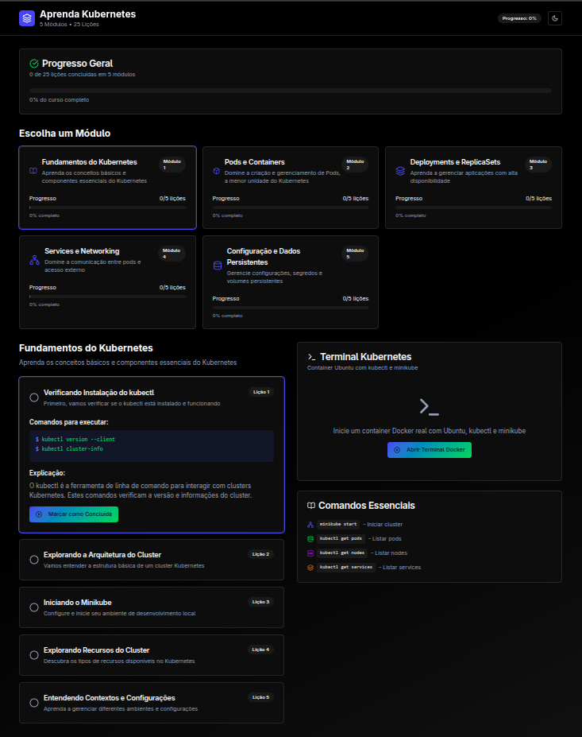

# Aprenda Kubernetes - Passo a Passo 🚀

Experimente um laboratório Kubernetes real, com terminal Docker Ubuntu, `kubectl` e `minikube`, tudo via navegador e com interface moderna, escura e responsiva.

---

## 🖼️ Interface Visual



---

## Recursos Principais
- **Terminal Docker Real**: Use comandos reais do Ubuntu, kubectl e minikube em um container isolado.
- **Passo a Passo Interativo**: Siga lições guiadas, execute comandos sugeridos e veja seu progresso.
- **Modo escuro e visual moderno**: Interface inspirada em Shadcn UI, com terminal estilizado, feedback visual e responsividade.
- **Ambiente persistente**: Cada usuário tem seu próprio container, que persiste por até 60 minutos mesmo após recarregar a página.
- **Multiusuário**: Backend Node.js com Socket.io, Dockerode e controle de recursos.

---

## Como rodar localmente

1. **Clone o repositório:**
   ```bash
   git clone https://github.com/seu-usuario/seu-repo.git
   cd seu-repo
   ```
2. **Instale as dependências do backend:**
   ```bash
   cd backend
   npm install
   ```
3. **Build da imagem Docker personalizada:**
   ```bash
   docker build -t ubuntu-k8s .
   ```
4. **Rode o backend:**
   ```bash
   node server.js
   ```
5. **Rode o frontend:**
   ```bash
   cd ../ # volte para a raiz do projeto
   npm install
   npm run dev
   ```
6. **Acesse no navegador:**
   Abra [http://localhost:3000](http://localhost:3000)

---

## Tecnologias
- **Frontend**: React, xterm.js, socket.io-client, Shadcn UI
- **Backend**: Node.js, Express, socket.io, dockerode
- **Infra**: Docker, Ubuntu, kubectl, minikube

---

## Contribuição
Pull requests são bem-vindos! Sinta-se à vontade para propor melhorias, novos passos ou integrações.

---

## Autor
Desenvolvido por [Seu Nome Aqui]
